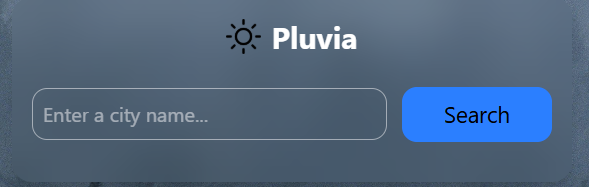
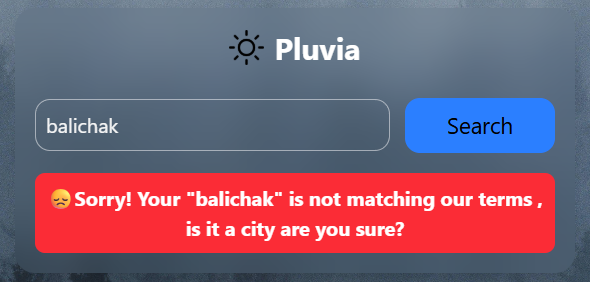
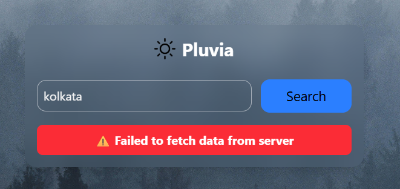
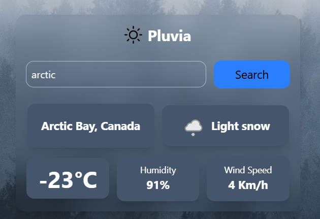

# Pluvia Weather App

A simple weather application that fetches real-time weather data using an API and displays it in a clean user interface.

# Live Link

https://pluvia-sable.vercel.app/

# Features

* Search weather by city name
* Displays:
  * Location (City, Country)
  * Weather condition
  * Temperature (°C)
  * Humidity
  * Wind speed
* Dynamic UI updates based on API response
* Error handling for invalid input or API issues

# Tech Stack

* HTML
* CSS
* JavaScript (DOM + Fetch API)
* Weather API- https://api.weatherapi.com/v1/current.json?key=b28fdeda371449df927174122260804&q=dubai 

# How It Works

1. User enters a city name
2. App sends a request to the weather API
3. API returns weather data in JSON format
4. Data is displayed dynamically on the page

# Note

* Enter *city names* for accurate results (e.g., Kolkata, London)
* Weather data depends on API accuracy completely

# Future Improvements

* Background changes based on weather
* Day/Night theme using `is_day`
* Add weather icons and animations
* Responsive design for mobile

# Screenshots

# Normal Look

# Wrong Input Error

# API Error

# View After API Call

# Full Page View

# Author

*Sisir Sen*
